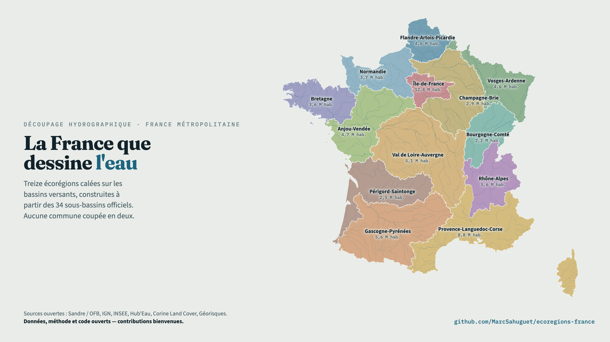

# La France que dessine l'eau



Carte interactive du découpage de la France métropolitaine en **13 écorégions hydrographiques**,
avec, pour chacune, ses indicateurs écologiques, économiques et de ressources — tous calculés à
partir de données publiques ouvertes.

- **Livrable** : [`site/index.html`](site/index.html) — page autonome, aucune dépendance réseau
  (hors polices Google), thèmes clair et sombre, responsive.
- **Synthèse documentaire** : [`docs/litterature.md`](docs/litterature.md).
- **Provenance de chaque chiffre** : [`docs/donnees.md`](docs/donnees.md).
- **Contribuer, contester un chiffre** : [`CONTRIBUTING.md`](CONTRIBUTING.md).

> Ce dépôt existe pour être contesté. Chaque indicateur est calculé par un script à partir d'une
> source ouverte : si un chiffre vous paraît faux, il est traçable, et corrigeable en pull request.

## Comment c'est construit

```
scripts/01_fetch.sh          téléchargements idempotents (Sandre/OFB, INSEE, SDES, Hub'Eau)
scripts/groups.py            règle d'agrégation : 34 sous-bassins DCE -> 13 écorégions
scripts/commune_map.py       table commune -> sous-bassin (référentiel Sandre)
scripts/02_build_geometry.py géométries projetées en coordonnées écran -> data/out/geometry.json
scripts/03_indicators.py     indicateurs par écorégion            -> data/out/indicators.json
scripts/04_debits.py         débit moyen de la station principale -> data/out/debits.json
scripts/06_saisonnalite.py   débit mois par mois (Hub'Eau)        -> data/out/saisonnalite.json
scripts/07_transfrontalier.py bassins complets et part française  -> data/out/transfrontalier.json
scripts/08_risques.py        inondation et submersion (GASPAR)    -> data/out/risques.json
scripts/recits.py            récits et revue de presse par écorégion (27 articles)
scripts/couts.py             coûts de la réforme de 2015 et données d'opinion, sourcés
scripts/05_render.py         injection des données dans le gabarit -> site/index.html
scripts/09_carte_sociale.py  cartes haute définition pour les réseaux -> export/
scripts/shot.sh              captures d'écran de contrôle (Chrome headless)
```

### Reproduire

```bash
python3 -m venv .venv && .venv/bin/pip install shapely pyproj openpyxl pyshp
bash scripts/01_fetch.sh
.venv/bin/python scripts/02_build_geometry.py     # géométries -> geometry.json
.venv/bin/python scripts/04_debits.py             # station de référence par écorégion
.venv/bin/python scripts/06_saisonnalite.py       # débit mois par mois (dépend de 04)
.venv/bin/python scripts/03_indicators.py         # indicateurs (dépend de 04)
.venv/bin/python scripts/07_transfrontalier.py    # bassins complets
.venv/bin/python scripts/08_risques.py            # inondation et submersion
.venv/bin/python scripts/05_render.py             # assemble site/index.html
```

Le téléchargement complet représente environ 600 Mo (dont 361 Mo pour HydroBASINS) (`data/raw/`, non versionné).
`scripts/04_debits.py` interroge Hub'Eau station par station : compter quelques minutes.

## Le découpage

Briques de base : les **34 sous-bassins DCE administratifs** du référentiel Sandre (OFB), qui
suivent les limites communales — aucune commune n'est coupée en deux. Regroupement en 13 écorégions
sous trois contraintes : continuité hydrographique, respect des circonscriptions de bassin de 1964,
équilibre démographique. La règle est lisible dans `scripts/groups.py`.

Les noms d'écorégion sont des propositions : ils reprennent des provinces, des massifs et des
pays déjà nommés plutôt que des hydronymes, pour ne pas ajouter une blessure symbolique au
redécoupage. Un nom de collectivité se décide par consultation, comme en 2016 pour l'Occitanie.

| Écorégion | Habitants | km² | Prélèvements* |
|---|---:|---:|---:|
| Île-de-France | 12,39 M | 13 409 | 1 409 Mm³ |
| Provence-Languedoc-Corse | 8,79 M | 68 383 | 4 319 Mm³ |
| Rhône-Alpes | 5,64 M | 33 933 | 12 015 Mm³ |
| Gascogne-Pyrénées | 5,55 M | 72 792 | 1 459 Mm³ |
| Val de Loire-Auvergne | 5,06 M | 81 207 | 1 713 Mm³ |
| Anjou-Vendée | 4,74 M | 45 688 | 1 422 Mm³ |
| Flandre-Artois-Picardie | 4,59 M | 18 789 | 811 Mm³ |
| Vosges-Ardenne | 4,56 M | 32 731 | 2 552 Mm³ |
| Normandie | 3,68 M | 31 635 | 574 Mm³ |
| Bretagne | 3,58 M | 29 665 | 282 Mm³ |
| Champagne-Brie | 2,92 M | 49 306 | 1 958 Mm³ |
| Périgord-Saintonge | 2,48 M | 44 489 | 5 354 Mm³ |
| Bourgogne-Comté | 2,19 M | 26 930 | 784 Mm³ |

\* moyenne 2020-2022, hors turbinage hydroélectrique. Les volumes de refroidissement des
centrales nucléaires sont prélevés puis, pour l'essentiel, restitués.

## Coût et acceptabilité

La section « Ce que ça coûterait » confronte le précédent chiffré de 2015 (Cour des comptes,
24 septembre 2019) à l'ampleur du bouleversement induit ici, calculée sur les mêmes données :
**20,3 % de la population** changerait de collectivité de rattachement et **32 départements sur 96**
seraient partagés entre deux écorégions ou plus — là où la réforme de 2015 n'avait scindé aucun
département. Les chiffres d'opinion (CSA/Sénat 2020, Ifop 2025, Institut Terram) sont dans
`scripts/couts.py`, chacun avec sa source.

## Sources

Toutes sous Licence Ouverte 2.0 ou équivalent : Sandre/OFB (sous-bassins DCE, régions
hydrographiques, cours d'eau, BD TOPAGE® 2025), INSEE (populations légales, comptes régionaux),
SDES (Corine Land Cover 2018 par commune), Hub'Eau (BNPE prélèvements, hydrométrie),
IGN (contours administratifs). Ajout de HydroBASINS niveau 6 (HydroSHEDS, WWF) sous licence
CC-BY 4.0 pour les bassins transfrontaliers complets, et base GASPAR (Géorisques) pour
l'exposition au risque d'inondation et de submersion.

## Licence

Code sous licence MIT. Les données dérivées de `data/out/` restent soumises aux licences de leurs
sources — Licence Ouverte 2.0 pour les producteurs publics français, CC-BY 4.0 pour HydroSHEDS.
Détail dans [`docs/donnees.md`](docs/donnees.md).

## Avertissement

Le découpage en 13 écorégions présenté ici est une **construction documentée, pas un document
officiel**. Il s'inspire du débat ouvert en juillet 2026, dont les promoteurs n'ont publié
ni liste de noms ni carte.
